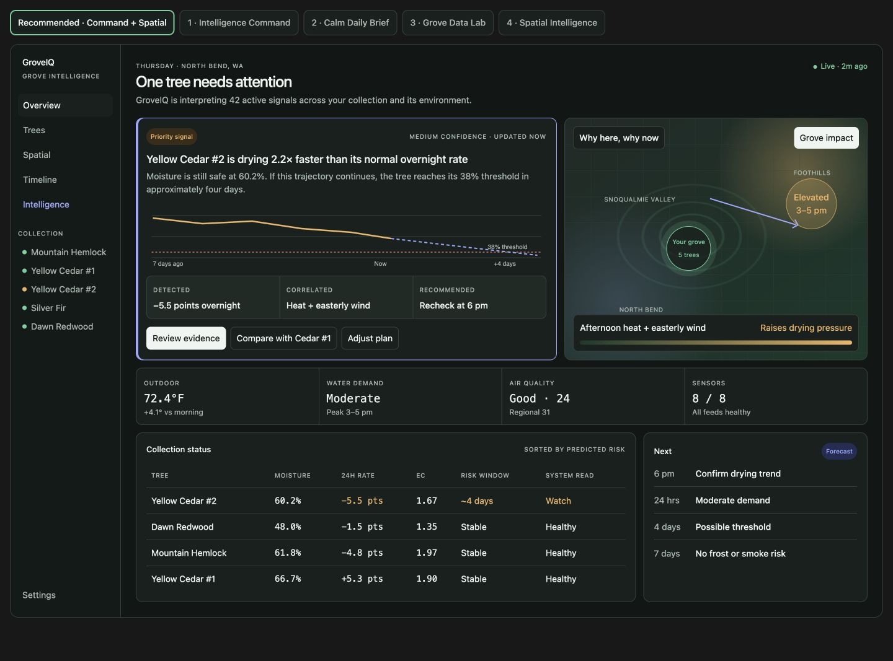

# GroveIQ Command + Spatial Redesign Specification

Status: Approved design direction; implementation-ready product and engineering brief  
Audience: Claude or another implementation agent working directly in this repository  
Primary surface: `frontend/` React application  
Approved direction: Intelligence Command + Spatial Intelligence hybrid  
Last updated: 2026-08-13

## Approved Concept Preview



The screenshot is a visual direction reference, not a source of hardcoded production data. Implementation must follow the data-integrity constraints and acceptance criteria in this specification.

## 1. Mission

Redesign GroveIQ so it feels like an intelligent grove-monitoring and decision system while preserving its calm, botanical character.

The current product is attractive and coherent, but it reads primarily as a digital field journal with sensor readings. GroveIQ already has richer data and analysis than the interface communicates. The redesign must expose that intelligence through prioritization, prediction, comparisons, evidence, and recommended actions.

The desired product impression is:

> A grove command center that continuously interprets tree, environmental, forecast, imagery, and regional data—then explains what matters, why it matters, which trees are affected, and what the user should do next.

The product must not become a generic enterprise dashboard, generic weather app, or decorative “AI” interface.

## 2. Required Outcomes

After the redesign, a user opening the Grove screen must be able to answer the following within five seconds:

1. Does anything need attention?
2. Which tree or grove condition is affected?
3. What did GroveIQ detect?
4. What is likely to happen next?
5. What evidence supports that conclusion?
6. What action should the user take, and when?
7. Are sensors and data feeds healthy enough to trust the recommendation?

The interface must also make the following product capabilities visibly apparent without relying on marketing language:

- Live monitoring
- Per-tree baselines and thresholds
- Anomaly detection
- Forecasting and projected threshold crossings
- Cross-signal correlation
- Species-aware interpretation
- Spatial and regional context
- Explainable recommendations
- Sensor and data-source health
- Historical and comparative analysis

## 3. Current-State Diagnosis

### 3.1 What currently works

- The visual system is calm, legible, and appropriate for bonsai.
- The sidebar and tree collection navigation are understandable.
- Status colors are restrained and semantically consistent.
- Tree cards provide a useful quick scan of moisture, trend, EC, and temperature.
- The existing analysis logic already compares readings with tree-specific thresholds and typical movement.
- The existing insight content contains valuable intelligence: evidence, baseline comparison, likely cause, implication, and suggested action.
- Environment data is extensive and includes current conditions, historical readings, forecast, solar/daylight, heat stress, and air quality.

### 3.2 What must change

- The Grove screen begins with a generic greeting rather than a system conclusion.
- AI output is presented as prose inside a card with similar weight to ordinary content.
- Healthy tree cards consume substantial space while repeating low-information states.
- Data relationships are not prominent. Users see measurements more often than interpretations.
- Prediction, confidence, evidence, and recommended action do not have a distinct visual grammar.
- The main dashboard shows only a small subset of the data available elsewhere.
- “Insights” feels like a separate feed instead of the intelligence layer that organizes the whole product.
- The regional map is composed of third-party Windy and PurpleAir embeds. Their controls, visual language, and interaction models dominate the experience and cannot be styled from GroveIQ because they are cross-origin iframes.
- The map presents available layers but does not immediately explain their impact on the user’s trees.

## 4. Product Principles

All implementation decisions must follow these principles, in priority order.

### 4.1 Lead with the conclusion

The top of the dashboard must state what needs attention. Do not lead with a greeting, a raw metric grid, or a feed of cards.

### 4.2 Show relationships, not merely more numbers

The request to expose more data does not mean placing every measurement on the homepage. Prefer:

- Current value versus tree-specific range
- Current rate versus the tree’s normal rate
- Local reading versus regional reading
- Observed trend versus projected trend
- Current risk versus upcoming risk window
- Tree-to-tree comparisons within the same species
- Environmental driver versus resulting tree response

### 4.3 Make intelligence inspectable

Every non-trivial GroveIQ conclusion should expose:

- Detection
- Evidence
- Baseline or comparison frame
- Projection or implication
- Confidence
- Recommended action
- Timestamp and freshness

Do not use a sparkle icon, gradient, or “AI” label as a substitute for evidence.

### 4.4 Preserve botanical calm

Keep the restrained green, neutral canvas, generous spacing, and editorial clarity. Add technical density through structure, charts, matrices, and hierarchy rather than neon colors or excessive visual effects.

### 4.5 Progressive disclosure

The dashboard should summarize. Tree Detail, Environment, Timeline, and Intelligence surfaces should explain. Raw/provider-specific data should remain available but secondary.

### 4.6 Never fabricate precision

- Do not hardcode a count such as “42 active signals.” Calculate it from available feeds or replace it with truthful language.
- Do not show a confidence level unless the system has an explicit rule for deriving it.
- Do not display spatial heat contours unless they come from a real spatial dataset or provider layer.
- Do not label a cause as confirmed when it is only correlated or hypothesized.
- Do not silently mix demo tree data with live environmental readings.

## 5. Target Information Architecture

Update the main navigation language to make the intelligence layer feel native to the product.

Recommended navigation:

1. Overview
2. Trees
3. Spatial
4. Timeline
5. Intelligence
6. Settings

Mapping from current routes:

- `Grove` becomes `Overview` while retaining `/`.
- `Trees` remains `/trees`.
- `Environment` should evolve into `Spatial` or a combined `Environment & Spatial` surface. Prefer `/spatial` with a redirect from `/environment` if changing the route is acceptable.
- `Timeline` remains `/timeline`.
- `Insights` becomes `Intelligence`, retaining `/insights` initially to avoid unnecessary route migration.
- Settings remains `/settings`.

Do not remove access to species profiles, imagery, notifications, or environmental details.

## 6. Overview Screen: Required Layout

The redesigned Overview screen replaces the current `Grove` screen hierarchy.

Desktop order:

1. Situational header
2. Priority intelligence + spatial evidence split
3. Live grove-condition strip
4. Collection status matrix + next-risk panel
5. Optional recent intelligence/activity section

Mobile order:

1. Situational header
2. Priority intelligence
3. Spatial evidence
4. Recommended action
5. Live grove-condition grid
6. Collection status cards or horizontally scrollable table
7. Next-risk panel

### 6.1 Situational header

Replace “Good morning/afternoon/evening” with a dynamic conclusion.

Examples:

- `One tree needs attention`
- `Your grove is stable`
- `Two conditions require action today`
- `Live data is incomplete`

Supporting line should describe system coverage truthfully:

- Preferred: `GroveIQ is interpreting live tree, weather, air-quality, and forecast signals.`
- If a calculated signal count is implemented: `GroveIQ is interpreting {count} active signals across {treeCount} trees.`

Header requirements:

- Show location and current date as a small eyebrow.
- Show freshness as `Live · 2m ago`, `Partially stale`, or `No live data`.
- Do not claim “live” when all current values are demo or unavailable.
- Data freshness must be derived from timestamps, not component render time.

### 6.2 Priority intelligence panel

This is the strongest visual element on the page.

Required content:

- Status: watch or urgent
- Affected tree or grove-wide scope
- Plain-language detection headline
- Current value
- Comparison with personal baseline or threshold
- Short projection
- Confidence, if derived
- Evidence chart
- Recommended action
- Links/actions for deeper review

Example structure:

```
Priority signal                              Medium confidence · updated now

Yellow Cedar #2 is drying 2.2× faster than its normal overnight rate

Moisture is still safe at 60.2%. If this trajectory continues, the tree
reaches its 38% threshold in approximately four days.

[Observed trend] [Now] [Projected trend] [Threshold]

Detected              Correlated               Recommended
−5.5 points overnight Heat + easterly wind      Recheck at 6 pm

[Review evidence] [Compare with Cedar #1] [Adjust plan]
```

Visual requirements:

- Use the existing intelligence indigo as the structural accent.
- Use amber/red only for severity and threshold risk.
- Include a solid observed line and a clearly differentiated dashed projected line.
- Include the tree-specific threshold as a labeled reference line or band.
- The chart must clearly mark where observed data ends and forecast/projection begins.
- Never imply a forecast is an observation.
- Keep evidence labels readable without hovering.

Behavior:

- `Review evidence` navigates to a focused intelligence detail or the relevant tree detail with the insight expanded.
- `Compare with Cedar #1` opens the comparative view with the two same-species trees selected.
- `Adjust plan` should open a relevant plan/threshold/settings workflow only if that workflow exists. Otherwise omit the action rather than making a dead button.

### 6.3 Native spatial evidence panel

Place spatial evidence adjacent to the priority intelligence panel on desktop. This makes the map part of the explanation, not a separate feature demonstration.

Panel question:

> Why here, why now?

The panel must show only the spatial context relevant to the active priority signal by default.

For a drying anomaly, relevant context could include:

- Grove location
- Wind speed and direction
- Temperature or heat stress
- VPD/water-demand period
- Forecast peak time
- Exposure window

For smoke/AQI, relevant context could include:

- Local PM2.5/AQI
- Regional AirNow AQI
- Nearby PurpleAir context if available through a proper data source
- Wind direction
- Smoke risk or regional discussion

For frost, relevant context could include:

- Grove location
- Forecast low
- Frost-risk period
- Cold-air or topographic context only if supported by real data

Map requirements:

- GroveIQ controls and labels must sit outside or above the map, not compete with provider UI.
- Default layer name should describe tree impact, such as `Grove impact`, not provider terminology.
- Always show the grove marker.
- Show the affected-tree count or names in the adjacent impact panel.
- Show the relevant time window.
- Show source attribution for every external spatial layer.
- Provide a timestamp/freshness indicator.
- Use color conservatively: green for low, amber for elevated, red for urgent.
- The map must remain useful if external layer tiles fail; the interpretation and affected-tree list should still render.

Critical data limitation:

The current repository has a point location for the grove and point/current environmental readings. It does not contain a regional gridded dataset that can support a genuine heatmap. Therefore:

- Do not render invented regional gradients or contour fields in production.
- A directional wind vector, grove marker, forecast window, and provider-sourced overlay are acceptable.
- Any heat, precipitation, smoke, radar, or wind field must come from a licensed/authorized provider layer or API.
- If real overlay data is not yet available, implement a native spatial-context card with a base map, grove marker, directional vector, and impact annotation. Keep Windy/PurpleAir under a secondary `Source maps` section.

### 6.4 Live grove-condition strip

Display four grouped operational summaries, not an arbitrary set of weather measurements.

Recommended default groups:

1. Outdoor
   - Current temperature
   - Change since morning or daily range
2. Water demand
   - Low/moderate/high
   - VPD and peak window
3. Air quality
   - Local AQI/category
   - Regional comparison
4. Sensors
   - Reporting channels / expected channels
   - Overall freshness or warning

Requirements:

- Each group has one primary value and one explanatory secondary line.
- Use `—` with an explicit availability message when data is missing.
- Never convert a missing rain value into `None`; distinguish zero rainfall from unknown rainfall.
- Provide drill-down links to the relevant Environment/Spatial section.

### 6.5 Collection status matrix

Replace or supplement the repeated Overview tree cards with a compact comparison matrix.

Default columns:

- Tree
- Moisture
- 24-hour rate or most relevant rate window
- EC
- Soil temperature
- Risk window
- System interpretation

Ordering:

1. Urgent
2. Watch
3. Healthy with unusual movement
4. Stable healthy
5. Unknown/stale

Requirements:

- Values must be derived from the same analysis object used for status and insight generation.
- Do not allow the card, status dot, insight, and matrix to disagree.
- Highlight cells, not entire rows, unless the entire tree state is urgent.
- Show explicit `Stale`, `Demo`, or `Unavailable` states.
- Clicking a row opens Tree Detail.
- On narrow screens, convert each row to a compact tree summary or use a horizontally scrollable table with the tree name frozen if feasible.

### 6.6 Next-risk panel

Show a short time-indexed sequence:

- Next recommended check
- Next 24-hour water-demand or weather condition
- Predicted threshold crossings
- Seven-day frost/wind/smoke risk

Do not list neutral forecast facts solely to fill the panel. Show at most four items.

### 6.7 Recent intelligence/activity

Optional below the primary dashboard content.

Candidate events:

- Anomaly opened or resolved
- New photo analysis
- Forecast risk recalculated
- Regional AQI corroborated
- Sensor went stale or recovered
- Milestone detected or recorded

Use this section only if the backend provides a truthful event stream. Do not synthesize events from component renders.

## 7. Spatial Surface Redesign

The current `RegionalMaps` component is a third-party embed switcher. It should no longer be the primary spatial experience.

### 7.1 Desired spatial hierarchy

1. Grove impact summary
2. Native GroveIQ spatial context
3. Affected trees
4. Time window
5. Evidence/source attribution
6. Advanced provider maps

### 7.2 Recommended component model

Create a native shell such as:

```
SpatialIntelligence
├── SpatialHeader
├── ImpactLayerSelector
├── GroveMap
│   ├── GroveMarker
│   ├── WindVector
│   ├── ProviderOverlay (optional)
│   ├── RiskWindowOverlay
│   └── SourceAttribution
├── GroveImpactSummary
│   ├── Interpretation
│   ├── Confidence
│   ├── AffectedTreeList
│   └── RecommendedAction
├── TimeWindowSelector
└── SourceMapsDisclosure
    ├── WindyEmbed
    └── PurpleAirEmbed
```

The current Windy and PurpleAir embeds may remain temporarily, but move them under an explicitly secondary `Regional source maps` disclosure or tab.

### 7.3 Layer model

Use GroveIQ language:

- `Grove impact`
- `Air & smoke`
- `Wind exposure`
- `Frost risk`
- `Precipitation`

Avoid leading with provider names or provider-specific layer terminology.

When a layer is selected, update all of the following together:

- Map overlay
- Interpretation
- Affected trees
- Time window
- Legend
- Data source
- Freshness

### 7.4 Native-map implementation constraints

Before adding a mapping dependency, verify:

- License compatibility
- Tile-provider terms
- Required attribution
- API-key handling
- CSP and Cloudflare deployment requirements
- Bundle size and lazy-loading strategy
- Mobile interaction behavior
- Reduced-motion behavior

A library such as MapLibre may be appropriate, but the implementation agent must verify current package and provider requirements rather than assuming them.

If a native base map cannot be added immediately, implement the GroveIQ-native interpretation, affected-tree panel, time selector, and source-map disclosure first. Do not delay the entire dashboard redesign on map infrastructure.

## 8. Intelligence Model and Copy Grammar

### 8.1 Insight data contract

The current `Insight` type should evolve from presentation-oriented strings into a structured contract.

Recommended conceptual shape:

```ts
type IntelligenceSignal = {
  id: string;
  scope: 'tree' | 'grove' | 'environment';
  treeId?: string;
  status: 'ok' | 'watch' | 'urgent' | 'unknown';
  detectedAt: string;
  updatedAt: string;
  title: string;
  summary: string;
  detection: {
    metric: string;
    currentValue: number | string | null;
    unit?: string;
    change?: number;
    changeWindow?: string;
  };
  comparison?: {
    type: 'threshold' | 'personal_baseline' | 'peer' | 'regional';
    value?: number | string;
    description: string;
  };
  projection?: {
    value?: number | string;
    horizon: string;
    description: string;
    method?: string;
  };
  drivers?: Array<{
    label: string;
    relationship: 'correlated' | 'likely' | 'confirmed';
    description: string;
  }>;
  confidence?: {
    level: 'low' | 'medium' | 'high';
    rationale: string;
  };
  action?: {
    label: string;
    dueAt?: string;
    description: string;
  };
  evidenceSeries?: EvidenceSeries[];
  sourceFreshness: SourceFreshness[];
};
```

This exact type is not mandatory, but the rendered UI must not parse structured facts back out of long prose strings.

### 8.2 Language rules

Use:

- `GroveIQ detected…`
- `Compared with this tree’s 14-day baseline…`
- `At the current rate…`
- `Likely related to…`
- `Correlated with…`
- `Recheck at…`

Avoid:

- `The AI thinks…`
- `AI-powered insight`
- `Smart recommendation`
- Definitive causal claims unsupported by the data
- Anthropomorphic certainty
- Long generic horticultural explanations on the Overview screen

### 8.3 Confidence

Do not add confidence badges until a deterministic confidence rule exists.

Possible rule inputs:

- Number of readings in the baseline window
- Feed freshness
- Missing-value rate
- Magnitude relative to typical variation
- Agreement among multiple signals
- Forecast horizon

Document the rule in code and test boundary cases.

## 9. Data Surface Mapping

### 9.1 Tree data

Available or modeled:

- Soil moisture
- Soil temperature
- Soil EC
- Daily min/max/average
- Rate of change
- Typical swing
- Threshold range
- Days to threshold
- Development stage
- Species reference
- Last watered
- Milestones
- Photo/vision analyses

Use on Overview:

- Moisture
- Rate versus baseline
- EC
- Soil temperature when relevant
- Risk window
- Status

Keep in Tree Detail:

- Full profile
- Threshold editing
- Species-specific guidance
- Long history
- Imagery and analyses
- Milestones
- Notes

### 9.2 Environmental data

Available:

- Outdoor temperature
- Humidity
- Wind speed and direction
- Rain
- Pressure
- Solar radiation
- UV index
- Black-globe temperature
- WBGT
- PM2.5
- Local AQI and 24-hour AQI
- Device battery fields

Use on Overview only when operationally relevant. Do not show pressure, solar, UV, WBGT, and batteries as equal-weight cards by default.

Derived summaries should include:

- Water demand / VPD
- Heat-stress state
- Wind exposure
- Air-quality state
- Sensor health

### 9.3 Forecast and regional data

Available:

- Daily high/low
- Wind gust
- Precipitation chance
- Frost risk
- Sunrise/sunset/day length
- Regional AirNow AQI, category, reporting area, and discussion

Use for:

- Next-risk panel
- Spatial evidence
- Local-versus-regional AQI comparison
- Forecast alert explanations

## 10. Visual System Evolution

Retain the existing visual foundation in `theme.css`, but strengthen hierarchy.

### 10.1 Typography

- Keep Inter for interface text.
- Keep IBM Plex Mono for readings, deltas, timestamps, and technical evidence.
- Increase the distinction between conclusion headlines, section headings, labels, and evidence.
- Avoid excessive uppercase labels; reserve uppercase/eyebrow treatment for small metadata.
- Do not italicize scientific names so lightly that they become difficult to read.

### 10.2 Surfaces

- Standard data cards: neutral surface and border.
- Intelligence panel: neutral surface with indigo structural accent.
- Watch/urgent severity: amber/red only on status, risk cells, and threshold references.
- Map: visually contained, with GroveIQ controls outside the provider surface.
- Avoid heavy shadows, glassmorphism, or luminous AI gradients.

### 10.3 Charts

- Observed values: solid line.
- Projected values: dashed line.
- Threshold: labeled line or band.
- Safe range: subtle band where useful.
- Always include units.
- Ensure chart colors are distinguishable without relying solely on red/green.
- Tooltips may add precision, but core meaning must be visible without hover.

### 10.4 Status semantics

Add an explicit unknown/stale state to the current status model.

Recommended statuses:

- Healthy
- Watch
- Urgent
- Unknown
- Stale data

Do not show a green healthy state when required sensor data is missing.

## 11. Responsive Requirements

### Desktop

- Sidebar remains visible at widths that can support it.
- Priority intelligence and spatial evidence appear side by side.
- Collection matrix shows all priority columns.
- Main content maximum width should allow the hybrid layout to breathe; reassess the current `maxWidth: 1000` limit.

### Tablet

- Priority and map may stack when the map or evidence chart becomes cramped.
- Sidebar may remain narrow or collapse according to the existing product pattern.
- Metric strip becomes a 2×2 grid.

### Mobile

- Navigation must not remain a fixed 232px sidebar.
- Use a compact top navigation, drawer, or bottom navigation.
- Intelligence conclusion and action appear before map imagery.
- Avoid forcing users to pan inside both the page and the map.
- Map touch gestures must not trap vertical page scrolling.
- Matrix must become readable cards or a deliberate horizontal table.
- Tap targets must be at least 44×44 CSS pixels where practical.

## 12. Accessibility Requirements

- Meet WCAG 2.1 AA contrast for text and interactive controls.
- Preserve visible keyboard focus.
- Do not encode status by color alone; include labels and/or icons.
- Every chart requires an accessible summary.
- Map content must have a text equivalent describing the selected layer, grove impact, affected trees, time window, and source.
- Embedded provider maps require descriptive iframe titles.
- All layer selectors must use real buttons with selected state via `aria-pressed` or tabs with correct semantics.
- Respect `prefers-reduced-motion` for chart transitions and map animation.
- Announce material live-data status changes politely, not continuously on every reading.
- Tables require proper headers and sensible reading order.

## 13. Loading, Empty, Error, Demo, and Stale States

Every data-dependent component must deliberately implement these states.

### Loading

- Preserve layout to prevent movement.
- Use quiet skeletons or placeholders.
- Do not show zeros as temporary values.

### Empty

- Explain what has not been configured or captured.
- Provide the next relevant setup action.

### Error

- Use user-facing language.
- Do not expose raw JavaScript errors such as `TypeError: Failed to fetch` in the primary interface.
- Offer a retry when meaningful.
- Keep unaffected sections functional.

### Demo

- Demo data must be labeled at the section or source level, not appended awkwardly to the main sentence.
- Never combine live and demo data without labeling which is which.

### Stale

- Show last successful reading time.
- Downgrade confidence or suppress projections when inputs are too stale.
- Do not continue showing “Healthy” as if based on current readings.

## 14. Implementation Architecture

### 14.1 Component boundaries

Avoid continuing the current pattern of large screens composed mostly from inline style objects.

Recommended new components:

- `SituationalHeader`
- `PriorityIntelligencePanel`
- `EvidenceProjectionChart`
- `ReasoningSummary`
- `SpatialEvidencePanel`
- `GroveConditionStrip`
- `CollectionStatusMatrix`
- `NextRiskPanel`
- `DataFreshnessBadge`
- `SourceAttribution`
- `StatusState`

Use colocated CSS modules or a consistent project styling strategy. If preserving inline styles temporarily, centralize reusable layout and state styles rather than duplicating objects.

### 14.2 Suggested data hooks/selectors

- `useGroveOverview()`
- `usePrioritySignal()`
- `useSpatialContext(signal)`
- `useCollectionStatus()`
- `useDataHealth()`
- `useUpcomingRisks()`

These should centralize loading, error, stale, and demo-state behavior.

### 14.3 Single source of truth

The following must derive from one analysis result:

- Sidebar dot
- Tree card status
- Matrix status
- Priority signal
- Insight detail
- Alert action

Do not independently recalculate or restate status in multiple components.

## 15. File-Level Change Plan

Likely files to modify:

### `frontend/src/screens/Grove.tsx`

- Replace greeting-first layout.
- Compose the new Overview sections.
- Remove duplicated status logic from the render function where possible.
- Use a unified overview hook/model.

### `frontend/src/components/Layout.tsx`

- Rename navigation labels.
- Add responsive navigation behavior.
- Revisit sidebar collection density.
- Preserve direct access to each tree.

### `frontend/src/components/InsightPanel.tsx`

- Split into a reusable summary and detailed evidence presentation.
- Replace prose-only hierarchy with structured reasoning fields.
- Add explicit freshness and confidence handling.

### `frontend/src/components/RegionalMaps.tsx`

- Rename or decompose.
- Move Windy/PurpleAir embeds into a secondary provider-source section.
- Introduce native GroveIQ map shell and interpretation panel.
- Preserve provider titles and attribution.

### `frontend/src/screens/Environment.tsx`

- Reframe from a weather dashboard into GroveIQ environmental/spatial intelligence.
- Retain detailed raw metrics below the impact-first section.
- Replace raw error text with resilient error states.

### `frontend/src/data/types.ts`

- Add structured intelligence types.
- Add unknown/stale status where needed.
- Add source freshness and evidence-series types.

### `frontend/src/data/mockData.ts`

- Update mock intelligence to match the structured contract.
- Keep deterministic mock generation.
- Clearly expose mock/demo provenance.

### `frontend/src/lib/api.ts`

- Add overview aggregation functions only if server aggregation is unavailable.
- Preserve same-origin production behavior.
- Expose source timestamps and errors cleanly.

### `frontend/src/styles/theme.css`

- Add tokens for intelligence structure, chart projection, safe-range bands, stale/unknown states, map overlays, and responsive layout.
- Preserve dark-mode support.

### New files

Potential additions:

- `frontend/src/components/overview/SituationalHeader.tsx`
- `frontend/src/components/overview/PriorityIntelligencePanel.tsx`
- `frontend/src/components/overview/EvidenceProjectionChart.tsx`
- `frontend/src/components/overview/GroveConditionStrip.tsx`
- `frontend/src/components/overview/CollectionStatusMatrix.tsx`
- `frontend/src/components/overview/NextRiskPanel.tsx`
- `frontend/src/components/spatial/SpatialEvidencePanel.tsx`
- `frontend/src/components/spatial/GroveMap.tsx`
- `frontend/src/components/spatial/SourceMapsDisclosure.tsx`
- `frontend/src/hooks/useGroveOverview.ts`
- `frontend/src/hooks/useDataHealth.ts`

Exact paths may be adjusted to match project conventions.

## 16. Phased Delivery Plan

### Phase 1: Data and state model

- Create structured overview and intelligence view models.
- Add unknown/stale/demo provenance.
- Centralize priority ranking.
- Add tests for status consistency and projection boundaries.

### Phase 2: Overview shell

- Implement situational header.
- Implement priority intelligence panel and evidence chart.
- Implement condition strip.
- Implement collection matrix.
- Implement next-risk panel.

### Phase 3: Native spatial evidence

- Implement GroveIQ spatial shell.
- Show grove location and relevant point/vector context.
- Connect selected priority signal to affected trees and time window.
- Move third-party embeds into a secondary disclosure.
- Add real provider overlay only after data and licensing are validated.

### Phase 4: Navigation and responsive behavior

- Rename product surfaces.
- Add mobile navigation.
- Test hybrid layout across desktop, tablet, and mobile.

### Phase 5: Intelligence detail and consistency

- Refactor Insights into Intelligence.
- Ensure Overview, Tree Detail, sidebar, alerts, and Intelligence share the same analysis model.
- Add comparison workflow for same-species trees.

### Phase 6: Polish and QA

- Accessibility pass.
- Dark-mode pass.
- Data-state testing.
- Performance testing.
- Copy consistency review.
- Visual regression snapshots.

## 17. Testing Requirements

### Unit tests

- Priority ranking
- Threshold crossing calculation
- Typical-swing comparison
- Confidence derivation if implemented
- Freshness classification
- Local-versus-regional AQI comparison
- Missing-value handling
- Zero rainfall versus unknown rainfall
- Status consistency across derived views

### Component tests

- Priority panel for healthy, watch, urgent, unknown, stale, and demo states
- Observed versus projected chart distinction
- Matrix ordering
- Layer-selector semantics
- Map fallback without provider tiles
- Responsive matrix/card conversion
- Error messages do not include raw exceptions

### Integration tests

- Overview with live environmental data and demo tree data
- Overview with all live data
- Overview with environmental API failure
- Overview with one stale soil sensor
- Navigation from priority signal to tree evidence
- Navigation from map impact to affected tree
- Provider map lazy loading

### Visual testing widths

- 360px
- 768px
- 1024px
- 1440px

Test both light and dark modes.

## 18. Performance Requirements

- Do not load Windy or PurpleAir iframes on initial Overview render.
- Lazy-load provider embeds only after the user opens `Regional source maps`.
- Lazy-load the native mapping library if it is not needed above the fold or if bundle impact is significant.
- Avoid recalculating all mock histories on every render.
- Memoize derived collection analysis.
- Keep chart data windows appropriate to the displayed resolution.
- Prevent map interactions from causing the entire dashboard to rerender.

## 19. Acceptance Criteria

The redesign is complete only when all of the following are true:

1. Overview no longer begins with a generic greeting.
2. The highest-priority issue is visually dominant.
3. The priority issue displays detection, comparison, projection, and recommended action.
4. Observed and projected data are visually and semantically distinguishable.
5. Spatial context is connected to the active issue and affected trees.
6. No invented map contours or unsupported causal claims are displayed.
7. Third-party maps are secondary and lazy-loaded.
8. The collection can be compared across multiple metrics in one view.
9. Healthy, watch, urgent, unknown, stale, and demo states are handled deliberately.
10. Sidebar, Overview, Tree Detail, alerts, and Intelligence cannot disagree about tree status.
11. Raw JavaScript/API errors are not shown to users.
12. Mobile navigation and mobile content order are usable at 360px.
13. Core controls are keyboard accessible.
14. The product remains calm and botanical while clearly feeling technical and intelligent.
15. All build, lint, type, and relevant test commands pass.

## 20. Explicit Non-Goals

Do not include these unless separately approved:

- A generic chatbot taking over the homepage
- Decorative AI animations
- Autonomous watering actions
- Invented regional forecasting models
- A full GIS analysis suite
- Replacing every detailed Environment metric with AI summaries
- Removing the journal, timeline, species, or imagery capabilities
- Large dependency changes unrelated to the approved redesign
- A public marketing-site redesign

## 21. Instructions to the Implementation Agent

1. Inspect the repository and current data contracts before editing.
2. Preserve unrelated user changes.
3. Implement in phases; keep the app functional after each phase.
4. Do not fabricate data or hardcode mockup-only claims.
5. Prefer existing APIs and derived selectors before introducing new backend endpoints.
6. If a visual requires data the product does not have, implement an honest fallback and document the missing prerequisite.
7. Keep provider maps secondary and lazy-loaded.
8. Verify light mode, dark mode, keyboard navigation, and responsive layouts.
9. Run type checking, linting, build, and relevant tests.
10. At handoff, summarize changed files, implemented behaviors, known limitations, and any provider/API decisions still required.

## 22. Definition of the Approved Visual Direction

The final result should visually combine:

- The operational hierarchy and evidence-rich priority panel of an intelligence command center
- A GroveIQ-native spatial evidence panel positioned beside the active intelligence signal
- A concise live-condition strip
- A dense but readable collection comparison matrix
- A time-indexed upcoming-risk panel
- The existing calm green and neutral botanical palette

The map is not the hero by itself. The intelligence conclusion is the hero. The map explains the spatial drivers behind that conclusion.
